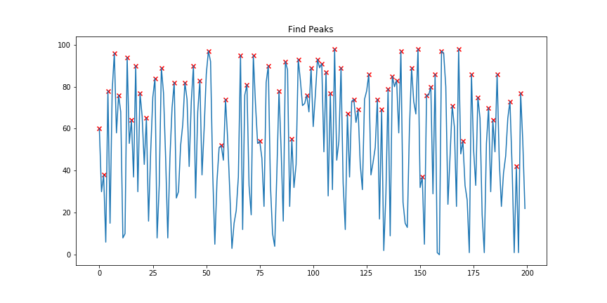
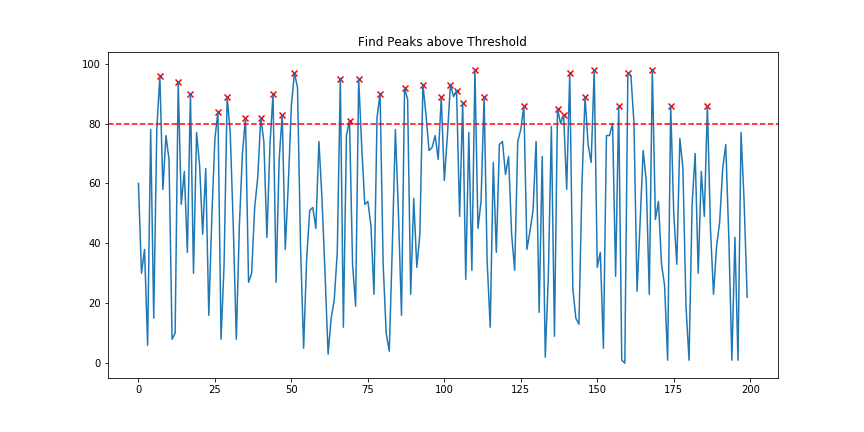

## Peak Finding algorithm 
It was implemented a Peak Finding algorithm in Pyhton in 4 versions 
- Find a Peak (2 versions)
- Find all Peaks
- Find all Peaks above threshold

Find all Peaks example:
  

Find all Peaks above threshold example:
 