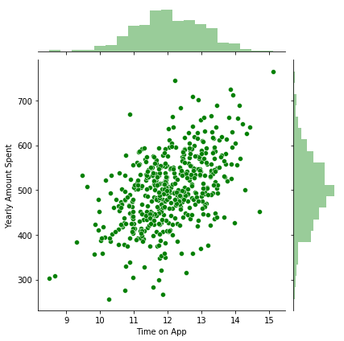
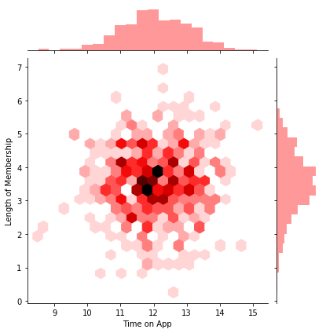
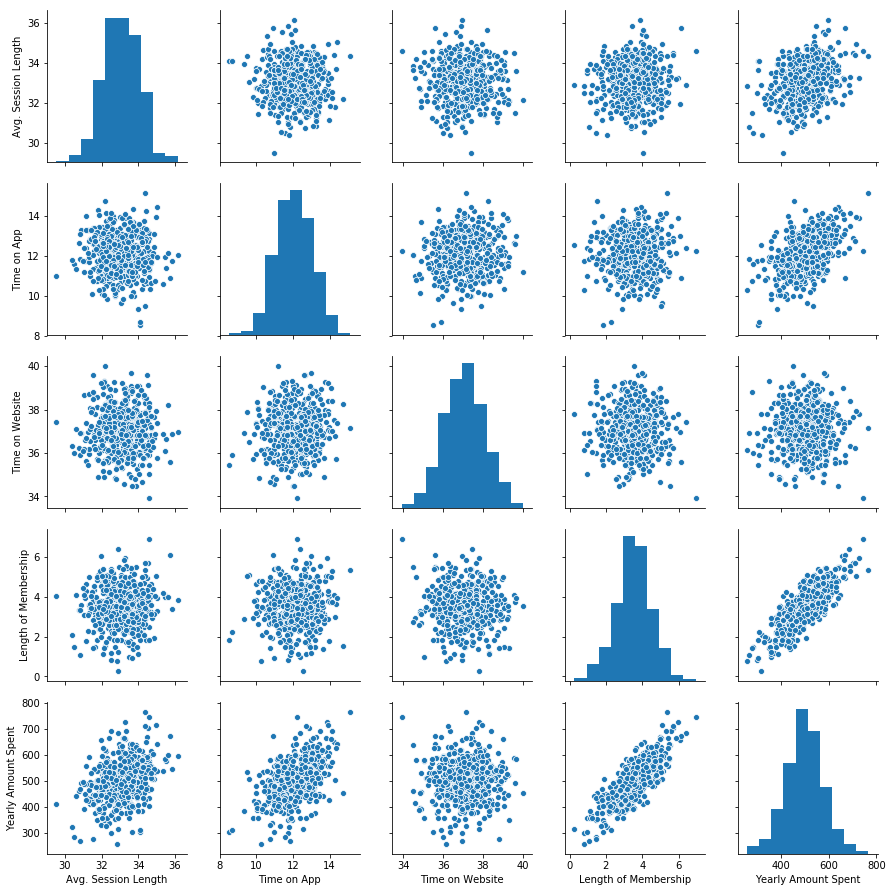
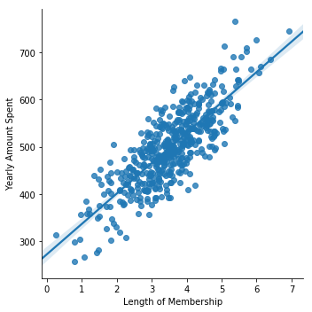
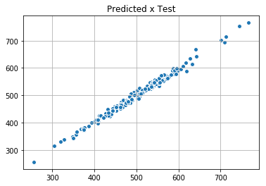
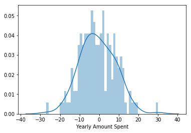

```python
import pandas as pd
import numpy as np
import matplotlib.pyplot as plt
import seaborn as sns
%matplotlib inline
```


```python
# import synthetic dataset(NOT REAL DATA) from csv file. From Udemy Course 
# "Python for Data Science Machine Learning Bootcamp - by Jose"
customers = pd.read_csv('Ecommerce Customers')
```


```python
# Verify data from dataset
customers.head()
```


<div>
<style scoped>
    .dataframe tbody tr th:only-of-type {
        vertical-align: middle;
    }

    .dataframe tbody tr th {
        vertical-align: top;
    }

    .dataframe thead th {
        text-align: right;
    }
</style>
<table border="1" class="dataframe">
  <thead>
    <tr style="text-align: right;">
      <th></th>
      <th>Email</th>
      <th>Address</th>
      <th>Avatar</th>
      <th>Avg. Session Length</th>
      <th>Time on App</th>
      <th>Time on Website</th>
      <th>Length of Membership</th>
      <th>Yearly Amount Spent</th>
    </tr>
  </thead>
  <tbody>
    <tr>
      <th>0</th>
      <td>mstephenson@fernandez.com</td>
      <td>835 Frank Tunnel\nWrightmouth, MI 82180-9605</td>
      <td>Violet</td>
      <td>34.497268</td>
      <td>12.655651</td>
      <td>39.577668</td>
      <td>4.082621</td>
      <td>587.951054</td>
    </tr>
    <tr>
      <th>1</th>
      <td>hduke@hotmail.com</td>
      <td>4547 Archer Common\nDiazchester, CA 06566-8576</td>
      <td>DarkGreen</td>
      <td>31.926272</td>
      <td>11.109461</td>
      <td>37.268959</td>
      <td>2.664034</td>
      <td>392.204933</td>
    </tr>
    <tr>
      <th>2</th>
      <td>pallen@yahoo.com</td>
      <td>24645 Valerie Unions Suite 582\nCobbborough, D...</td>
      <td>Bisque</td>
      <td>33.000915</td>
      <td>11.330278</td>
      <td>37.110597</td>
      <td>4.104543</td>
      <td>487.547505</td>
    </tr>
    <tr>
      <th>3</th>
      <td>riverarebecca@gmail.com</td>
      <td>1414 David Throughway\nPort Jason, OH 22070-1220</td>
      <td>SaddleBrown</td>
      <td>34.305557</td>
      <td>13.717514</td>
      <td>36.721283</td>
      <td>3.120179</td>
      <td>581.852344</td>
    </tr>
    <tr>
      <th>4</th>
      <td>mstephens@davidson-herman.com</td>
      <td>14023 Rodriguez Passage\nPort Jacobville, PR 3...</td>
      <td>MediumAquaMarine</td>
      <td>33.330673</td>
      <td>12.795189</td>
      <td>37.536653</td>
      <td>4.446308</td>
      <td>599.406092</td>
    </tr>
  </tbody>
</table>
</div>


```python
# Check some informations from dataset. indexes types, columns names,  total size ...
customers.info()
```

    <class 'pandas.core.frame.DataFrame'>
    RangeIndex: 500 entries, 0 to 499
    Data columns (total 8 columns):
    Email                   500 non-null object
    Address                 500 non-null object
    Avatar                  500 non-null object
    Avg. Session Length     500 non-null float64
    Time on App             500 non-null float64
    Time on Website         500 non-null float64
    Length of Membership    500 non-null float64
    Yearly Amount Spent     500 non-null float64
    dtypes: float64(5), object(3)
    memory usage: 31.3+ KB
    


```python
# Check statistic information from dataset
customers.describe()
```


<div>
<style scoped>
    .dataframe tbody tr th:only-of-type {
        vertical-align: middle;
    }

    .dataframe tbody tr th {
        vertical-align: top;
    }

    .dataframe thead th {
        text-align: right;
    }
</style>
<table border="1" class="dataframe">
  <thead>
    <tr style="text-align: right;">
      <th></th>
      <th>Avg. Session Length</th>
      <th>Time on App</th>
      <th>Time on Website</th>
      <th>Length of Membership</th>
      <th>Yearly Amount Spent</th>
    </tr>
  </thead>
  <tbody>
    <tr>
      <th>count</th>
      <td>500.000000</td>
      <td>500.000000</td>
      <td>500.000000</td>
      <td>500.000000</td>
      <td>500.000000</td>
    </tr>
    <tr>
      <th>mean</th>
      <td>33.053194</td>
      <td>12.052488</td>
      <td>37.060445</td>
      <td>3.533462</td>
      <td>499.314038</td>
    </tr>
    <tr>
      <th>std</th>
      <td>0.992563</td>
      <td>0.994216</td>
      <td>1.010489</td>
      <td>0.999278</td>
      <td>79.314782</td>
    </tr>
    <tr>
      <th>min</th>
      <td>29.532429</td>
      <td>8.508152</td>
      <td>33.913847</td>
      <td>0.269901</td>
      <td>256.670582</td>
    </tr>
    <tr>
      <th>25%</th>
      <td>32.341822</td>
      <td>11.388153</td>
      <td>36.349257</td>
      <td>2.930450</td>
      <td>445.038277</td>
    </tr>
    <tr>
      <th>50%</th>
      <td>33.082008</td>
      <td>11.983231</td>
      <td>37.069367</td>
      <td>3.533975</td>
      <td>498.887875</td>
    </tr>
    <tr>
      <th>75%</th>
      <td>33.711985</td>
      <td>12.753850</td>
      <td>37.716432</td>
      <td>4.126502</td>
      <td>549.313828</td>
    </tr>
    <tr>
      <th>max</th>
      <td>36.139662</td>
      <td>15.126994</td>
      <td>40.005182</td>
      <td>6.922689</td>
      <td>765.518462</td>
    </tr>
  </tbody>
</table>
</div>


```python
#Check columns' name
customers.columns
```


    Index(['Email', 'Address', 'Avatar', 'Avg. Session Length', 'Time on App',
           'Time on Website', 'Length of Membership', 'Yearly Amount Spent'],
          dtype='object')


## Exploratory Data Analysis 


```python
# Joint plots between variables, lets check relationship!
sns.jointplot('Time on Website', 'Yearly Amount Spent', data = customers,edgecolor = 'white', linewidth = 0.5)
```


    <seaborn.axisgrid.JointGrid at 0x18e2c4baf28>


```python
sns.jointplot('Time on App', 'Yearly Amount Spent', data = customers, edgecolor ='white', linewidth = 0.5, color='green')
```


    <seaborn.axisgrid.JointGrid at 0x18e2d8c8160>





```python
sns.jointplot('Time on App','Length of Membership', data = customers, kind = 'hex', color ='red' )
```


    <seaborn.axisgrid.JointGrid at 0x18e2d9b0898>





```python
# Pair plot of the entire dataset to verify the relationship between variables
sns.pairplot(customers)
```


    <seaborn.axisgrid.PairGrid at 0x1c036862908>





```python
# Length of Membership and Yearly Amount Spent are tthe two most correlated so lets do a linear regression plot  
sns.lmplot('Length of Membership', 'Yearly Amount Spent', data = customers)
```


    <seaborn.axisgrid.FacetGrid at 0x1c03357b4e0>





```python
from sklearn.model_selection import  train_test_split
from sklearn.linear_model import LinearRegression
from sklearn import metrics
```


```python
customers.columns
```


    Index(['Email', 'Address', 'Avatar', 'Avg. Session Length', 'Time on App',
           'Time on Website', 'Length of Membership', 'Yearly Amount Spent'],
          dtype='object')


```python
X = customers[['Avg. Session Length', 'Time on App',
       'Time on Website', 'Length of Membership']]
y = customers['Yearly Amount Spent']

# First lets split our data
X_train, X_test, y_train,y_test = train_test_split(X,y, test_size = 0.3, random_state = 101)

lm = LinearRegression()
lm.fit(X_train,y_train)
```


    LinearRegression(copy_X=True, fit_intercept=True, n_jobs=None, normalize=False)


```python
coef_df = pd.DataFrame(lm.coef_ , X.columns, columns = ['Coefficients'])
coef_df
```


<div>
<style scoped>
    .dataframe tbody tr th:only-of-type {
        vertical-align: middle;
    }

    .dataframe tbody tr th {
        vertical-align: top;
    }

    .dataframe thead th {
        text-align: right;
    }
</style>
<table border="1" class="dataframe">
  <thead>
    <tr style="text-align: right;">
      <th></th>
      <th>Coefficients</th>
    </tr>
  </thead>
  <tbody>
    <tr>
      <th>Avg. Session Length</th>
      <td>25.981550</td>
    </tr>
    <tr>
      <th>Time on App</th>
      <td>38.590159</td>
    </tr>
    <tr>
      <th>Time on Website</th>
      <td>0.190405</td>
    </tr>
    <tr>
      <th>Length of Membership</th>
      <td>61.279097</td>
    </tr>
  </tbody>
</table>
</div>


```python
y_hat = lm.predict(X_test) #Predicting from X_test

plt.scatter(y_test,y_hat, edgecolor ='white')
plt.grid(True)
plt.title('Predicted x Test')
```


    ---------------------------------------------------------------------------

    TypeError                                 Traceback (most recent call last)

    <ipython-input-83-0b609bec7938> in <module>
          4 plt.grid(True)
          5 plt.title('Predicted x Test')
    ----> 6 plt.ylabel('teste')
    

    TypeError: 'str' object is not callable





## Evaluating the Model 


```python
MAE = metrics.mean_absolute_error(y_test,y_hat)
MSE = metrics.mean_squared_error(y_test,y_hat)
RMSE = np.sqrt(MSE)
R2 = metrics.explained_variance_score(y_test,y_hat)
print(f'MAE: {MAE}\nMSE: {MSE}\nRMSE: {RMSE}\nR2: {R2}')

```

    MAE: 7.228148653430853
    MSE: 79.81305165097487
    RMSE: 8.933815066978656
    R2: 0.9890771231889606
    


```python
sns.distplot((y_test-y_hat), bins =  50)
```


    <matplotlib.axes._subplots.AxesSubplot at 0x1c0368ad0f0>





```python

```
